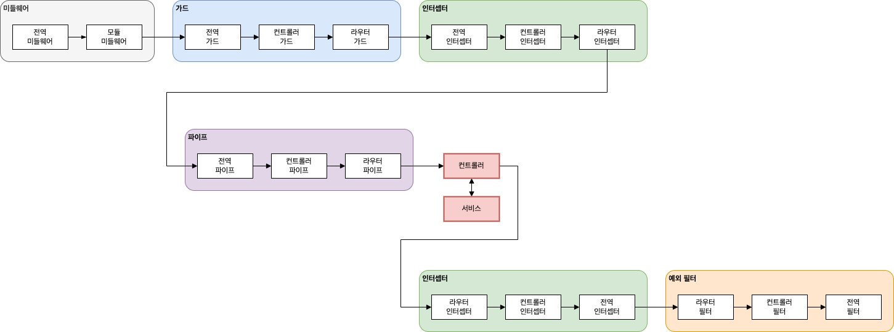

# 🖥️ 온라인 공연 예매 서비스 구현

## 프로젝트 소개
- 프로젝트 이름 : Show_Ticketing_Service
- 내용 : 타입스크립트 기반 온라인 공연 예매 서비스 구현
- 구분 : 개인 프로젝트
- 배포 : https://www.mymycode.shop... (API 명세서 참조)

## 1. 개발 기간
- 2024.06.29 ~ 2024.07.07

 

## 2. 개발 환경
- BackEnd : TypeScript, Nest.js, TypeORM
- Tool : AWS-S3, AWS-RDS, Insomnia, DBeaver

 

## 3. API 명세서 및 ERD
 - API 명세서 : https://west-territory-778.notion.site/API-a3b16c82cafb471b8fc54e0e63ce47d4?pvs=4
 - ERD : https://drawsql.app/teams/nodejs-express/diagrams/-4

 

## 4. 주요 기능 및 설명
### 4-1. 회원가입 
#### 4-1-1. 회원가입 Controller
- 회원가입 DTO를 통해서 회원가입에 필요한 데이터를 가져와서 Service에 넘깁니다.

- https://github.com/jkc-mycode/Show_Ticketing/blob/829bfeffab9cbdb159ffaacce60768b81a65ae73/src/auth/auth.controller.ts#L13-L22

#### 4-1-2. 회원가입 Service
- 비밀번호와 확인용 비밀번호를 비교해서 같지 않다면 에러를 반환합니다.

- 이메일, 닉네임 중 하나라도 중복이 있다면 에러를 반환합니다.

- (사실 중복 체크는 한 번의 Repository 접근으로도 가능할 것 같기에 수정이 필요해 보임)

- 입력받은 비밀번호를 암호화해서 데이터베이스에 사용자 정보를 저장합니다.

- https://github.com/jkc-mycode/Show_Ticketing/blob/829bfeffab9cbdb159ffaacce60768b81a65ae73/src/auth/auth.service.ts#L29-L56

 

### 4-2. 로그인
#### 4-2-1. 로그인 Controller
- 로그인 DTO를 통해서 사용자가 입력한 이메일, 비밀번호를 가져와서 Service에 넘깁니다.

- https://github.com/jkc-mycode/Show_Ticketing/blob/829bfeffab9cbdb159ffaacce60768b81a65ae73/src/auth/auth.controller.ts#L24-L28

#### 4-2-2. 로그인 Service
- 받아온 이메일로 사용자가 존재하는지 확인합니다.

- 그리고 암호화된 비밀번호와 사용자가 입력한 비밀번호를 검증합니다.

- 위 과정이 문제가 없다면 Access Token, Refresh Token을 발급합니다.

- Refresh Token은 따로 데이터베이스에 저장해서 관리합니다.

- https://github.com/jkc-mycode/Show_Ticketing/blob/829bfeffab9cbdb159ffaacce60768b81a65ae73/src/auth/auth.service.ts#L58-L101

 

### 4-3. 로그아웃
#### 4-3-1. 로그아웃 Controller
- `RefreshTokenGuard`를 통해서 사용자가 준 Refresh Token이 유효한지 확인합니다.

- 문제가 없다면 `@UserInfo()` 커스텀 데코레이터를 통해서 Request의 사용자 데이터를 가져와서 Service에 넘깁니다.

- https://github.com/jkc-mycode/Show_Ticketing/blob/829bfeffab9cbdb159ffaacce60768b81a65ae73/src/auth/auth.controller.ts#L30-L36

#### 4-3-2. 로그아웃 Service
- 한 번만 더 데이터베이스의 Refresh Token이 들어있는지 확인합니다.

- 그리고 Refresh Token은 데이터베이스에서 Soft Delete를 진행합니다.

- https://github.com/jkc-mycode/Show_Ticketing/blob/829bfeffab9cbdb159ffaacce60768b81a65ae73/src/auth/auth.service.ts#L103-L119

 

### 4-4. 토큰 재발급
#### 4-4-1. 토큰 재발급 Controller
- `RefreshTokenGuard`를 통해서 사용자가 준 Refresh Token이 유효한지 확인합니다.

- 문제가 없다면 `@UserInfo()` 커스텀 데코레이터를 통해서 Request의 사용자 데이터를 가져와서 Service에 넘깁니다.

- https://github.com/jkc-mycode/Show_Ticketing/blob/829bfeffab9cbdb159ffaacce60768b81a65ae73/src/auth/auth.controller.ts#L38-L44

#### 4-4-2. 토큰 재발급 Service
- Refresh Token이 유효한 것을 확인했느니 Access Token, Refresh Token을 재발급합니다.

- 그리고 Refresh Token은 데이터베이스에서 관리하기에 Token 컬럼의 데이터를 업데이트합니다.

- https://github.com/jkc-mycode/Show_Ticketing/blob/829bfeffab9cbdb159ffaacce60768b81a65ae73/src/auth/auth.service.ts#L121-L144

 

### 4-5. Refresh Token 가드
- `RefreshTokenGuard`는 기존 Express에서 사용하던 Refresh Token 인증 미들웨어를 기반으로 작성되었습니다.

- 이 가드의 역할은 사용자가 준 Refresh Token가 데이터베이스에 저장된 Refresh Token과 같은지 확인합니다.

- 그리고 같다면 Request에 사용자의 정보를 넣습니다.

- https://github.com/jkc-mycode/Show_Ticketing/blob/829bfeffab9cbdb159ffaacce60768b81a65ae73/src/auth/utils/refresh-token.guard.ts#L15-L58

 

### 4-6. Roles 가드
- `RolesGuard`는 사용자의 jwt 토큰을 검증하고 Request에 사용자 정보가 들어가면 그 사용자의 역할이 다음에 나오는 기능을 사용해도 되는지 검증하는 역할을 합니다.

- `@Roles(Role.Admin)` 와 같이 사용해서 어떤 사용자를 통과해줄 지 정해 줍니다.

- https://github.com/jkc-mycode/Show_Ticketing/blob/829bfeffab9cbdb159ffaacce60768b81a65ae73/src/auth/utils/roles.guard.ts#L11-L43

 

### 4-7. 사용자 프로필 조회
#### 4-7-1. 사용자 프로필 조회 Controller
- `@UserInfo()` 커스텀 데코레이터를 통해서 Request에 들어있는 사용자 정보를 가져옵니다.

- 이 때, 전역에서 AuthGuard('jwt')라는 가드가 있기 때문에 사용자가 준 Access Token의 유효성 검사를 진행합니다.

- 유효하다면 Request에 사용자 정보를 넣습니다.

- 그리고 Controller의 메서드를 사용할 수 있도록 통과시켜 줍니다.

- https://github.com/jkc-mycode/Show_Ticketing/blob/829bfeffab9cbdb159ffaacce60768b81a65ae73/src/user/user.controller.ts#L8-L19

#### 4-7-2. 사용자 프로필 조회 Service
- Request에 있는 사용자의 ID를 통해서 데이터베이스의 사용자 정보를 찾아서 반환합니다.

- https://github.com/jkc-mycode/Show_Ticketing/blob/829bfeffab9cbdb159ffaacce60768b81a65ae73/src/user/user.service.ts#L25-L28

 

### 4-8. 사용자 예매 목록 조회 
#### 4-8-1. 사용자 예매 목록 조회 Controller
- `@UserInfo()` 커스텀 데코레이터를 통해서 Request에 들어있는 사용자 정보를 가져옵니다.

- 이 때, 전역에서 AuthGuard('jwt')라는 가드가 있기 때문에 사용자가 준 Access Token의 유효성 검사를 진행합니다.

- 유효하다면 Request에 사용자 정보를 넣습니다.

- 그리고 Controller의 메서드를 사용할 수 있도록 통과시켜 줍니다.

- 사용자 프로필 조회와는 다르게 Request에 들어있는 사용자 정보를 그대로 Service로 넘깁니다.

- https://github.com/jkc-mycode/Show_Ticketing/blob/829bfeffab9cbdb159ffaacce60768b81a65ae73/src/user/user.controller.ts#L21-L25

#### 4-8-2. 사용자 예매 목록 조회 Service
- 받아온 사용자 정보에 있는 사용자 ID 값으로 티켓 Service에서 넘깁니다.

- 티켓 Service에서 사용자 ID를 기반해서 티켓 정보 목록을 가져옵니다.

- https://github.com/jkc-mycode/Show_Ticketing/blob/829bfeffab9cbdb159ffaacce60768b81a65ae73/src/user/user.service.ts#L54-L60

 

### 4-9. 공연 등록 
#### 4-9-1. 공연 등록 Controller
- 공연 등록 기능은 Admin만 사용 가능한 기능으로 공연 등록 DTO를 통해서 공연의 정보를 가져옵니다.

- `RolesGuard`를 통해서 로그인한 사용자가 사용 가능한지 역할을 검사합니다.

- 공연 등록 시 이미지를 업로드해야 하기 때문에 Aws-S3와 Multer를 이용해서 파일을 업로드합니다.

- 이 때, FilesInterceptor를 이용해서 사용자가 보내준 이미지 데이터들을 가져옵니다.

- 그 이미지 데이터는 `@UploadFils()` 데코레이터를 통해서 Service에 넘깁니다.

- https://github.com/jkc-mycode/Show_Ticketing/blob/829bfeffab9cbdb159ffaacce60768b81a65ae73/src/show/show.controller.ts#L24-L40

#### 4-9-2. 공연 등록 Service
- 사용자가 넘겨준 공연 정보, 이미지 데이터는 하나의 트랜젝션에서 등록되어야 하기 때문에 `QueryRunner`를 이용해서 트랜젝션 문법을 사용합니다.

- 접근하는 테이블이 하나가 아니기 때문에 트랜젝션이 없으면 일관성이 깨질 수 있습니다.

- 기본적인 공연의 정보를 저장하고 각 좌석들의 정보 역시 개별로 저장합니다.

- https://github.com/jkc-mycode/Show_Ticketing/blob/829bfeffab9cbdb159ffaacce60768b81a65ae73/src/show/show.service.ts#L41-L218

 

### 4-10. 공연 목록 조회
#### 4-10-1. 공연 목록 조회 Controller
- 공연 목록 조회는 전체 목록 조회와 카테고리 별 조회가 가능합니다.

- 카테고리 별 조회를 할 때는 URL상에 `쿼리 스트링`을 사용해서 사용자가 선택한 카테고리 데이터를 가져옵니다.

- 그러한 카테고리 데이터를 Service에 넘겨 줍니다.

- https://github.com/jkc-mycode/Show_Ticketing/blob/829bfeffab9cbdb159ffaacce60768b81a65ae73/src/show/show.controller.ts#L42-L46

#### 4-10-2. 공연 목록 조회 Service
- 어떤 카테고리로 조회할 지 데이터를 가져와서 데이터베이스에서 검색 합니다.

- 카테고리가 있으면 카테고리로 검새하고 아니면 전체를 반환합니다.

- https://github.com/jkc-mycode/Show_Ticketing/blob/829bfeffab9cbdb159ffaacce60768b81a65ae73/src/show/show.service.ts#L220-L248

 

### 4-11. 공연 상세 조회 
#### 4-11-1. 공연 상세 조회 Controller
- `Path Parameter`를 통해서 어떤 공연을 상세 조회할 지 공연 ID를 가져옵니다.

- 가져온 공연 ID를 Service에 넘깁니다.

- https://github.com/jkc-mycode/Show_Ticketing/blob/829bfeffab9cbdb159ffaacce60768b81a65ae73/src/show/show.controller.ts#L54-L58

#### 4-11-2. 공연 상세 조회 Service
- Controller에서 넘겨준 공연 ID로 데이터베이스에서 검색하고 해당 공연의 데이터를 가져옵니다.

- `relations` 옵션을 사용해서 관계를 형성한 다른 테이블의 데이터도 가져옵니다.

- 형식에 맞도록 정리해서 반환합니다.

- https://github.com/jkc-mycode/Show_Ticketing/blob/829bfeffab9cbdb159ffaacce60768b81a65ae73/src/show/show.service.ts#L280-L324

 

### 4-12. 공연 검색
#### 4-12-1. 공연 검색 Controller
- 제목을 통해서 공연을 검색하는 기능입니다.

- 사용자가 입력한 검색어는 `쿼리 스트링`을 통해서 가져와서 Service에 넘깁니다.

- https://github.com/jkc-mycode/Show_Ticketing/blob/829bfeffab9cbdb159ffaacce60768b81a65ae73/src/show/show.controller.ts#L48-L52

#### 4-12-2. 공연 검색 Service
- 원래는 그냥 TypeORM에서 제공해주는 메서드를 통해서 검색하려고 했는데, 쿼리 빌더를 통해서도 데이터베이스에 접근할 수 있다고 해서 한 번 활용했습니다.

- 사용 방법은 약간 Raw Query에 가까운 방식을 사용합니다.

- 그리고 해당 제목의 일부만 있어도 검색 가능하게 만들기 위해서 SQL의 LIKE와 같은 조건을 where 절에 넣어서 검색합니다.

- https://github.com/jkc-mycode/Show_Ticketing/blob/829bfeffab9cbdb159ffaacce60768b81a65ae73/src/show/show.service.ts#L250-L278

 

### 4-13. 공연 좌석 정보 조회
#### 4-13-1. 공연 좌석 정보 조회 Controller
- 어떤 공연의 좌석 정보들을 반환할지 알기 위해서 `Path Parameter`를 통해서 공연 ID를 가져옵니다.

- 가져온 공연 ID를 Service에 넘깁니다.

- https://github.com/jkc-mycode/Show_Ticketing/blob/829bfeffab9cbdb159ffaacce60768b81a65ae73/src/seat/seat.controller.ts#L35-L39

#### 4-13-2. 공연 좌석 정보 조회 Service
- Controller로부터 받아온 공연 ID를 기반으로 좌석 데이터베이스에서 데이터를 검색해서 가져옵니다.

- 그 중 현재 시간보다 이후의 공연에 대해서만 반환합니다.

- https://github.com/jkc-mycode/Show_Ticketing/blob/fa9dc43840bdcb3af78334709a365ec242322c89/src/seat/seat.service.ts#L116-L140

 

### 4-14. 공연 지정 좌석 예매
#### 4-14-1. 공연 지정 좌석 예매 Controller
- `AuthGuard('jwt')`를 통해서 로그인한 사용자인지, Access Token이 유효한지 확인합니다.

- 그리고 `SeatCheckInterceptor`를 통해서 사용자가 입력한 좌석이 예매된 좌석인지 체크합니다.

- 인터셉터는 컨트롤러에 접근 전/후에 어떠한 로직을 처리하기 위해서 사용합니다.

- https://github.com/jkc-mycode/Show_Ticketing/blob/829bfeffab9cbdb159ffaacce60768b81a65ae73/src/seat/seat.controller.ts#L22-L33

#### 4-14-2. 공연 지정 좌석 예매 Service
- 우선 해당 공연이 존재하는지, 존재한 좌석인지, 사용자의 포인트가 남아있는지 등을 확인합니다.

- 좌석 예매 역시 여러 다른 테이블의 데이터를 수정하거나 추가하기 때문에 하나의 트랜젝션에서 수행되어야 합니다.

- 그렇기에 `QueryRunner`를 통해서 트랜젝션 문법을 사용합니다.

- https://github.com/jkc-mycode/Show_Ticketing/blob/fa9dc43840bdcb3af78334709a365ec242322c89/src/seat/seat.service.ts#L36-L114

 

### 4-15. 공연 예매 취소 
#### 4-15-1. 공연 예매 취소 Controller
- `AuthGuard('jwt')`를 통해서 로그인한 사용자인지, Access Token이 유효한지 확인합니다.

- Request에 저장된 사용자 정보와 사용자가 입력한 예매 취소 DTO를 Service에 넘깁니다.

- https://github.com/jkc-mycode/Show_Ticketing/blob/829bfeffab9cbdb159ffaacce60768b81a65ae73/src/seat/seat.controller.ts#L15-L20

#### 4-15-2. 공연 예매 취소 Service
- Controller로부터 받아온 티켓 ID를 통해서 해당 티켓이 실제로 존재하는지, 취소된 티켓이 아닌지를 확인합니다.

- 그리고 예매 취소는 공연 시작 3시간 전까지만 가능합니다.

- 예매 취소 역시 좌석 예매와 거의 비슷한 로직이 수행되기 때문에 `QueryRunner`를 이용한 트랜젝션 문법을 사용해야 합니다.

- https://github.com/jkc-mycode/Show_Ticketing/blob/fa9dc43840bdcb3af78334709a365ec242322c89/src/seat/seat.service.ts#L142-L222

 

### 4-16. 좌석 예매 여부 체크 인터셉터
- `SeatCheckInterceptor`는 해당 좌석이 이미 예매된 좌석인지 확인하는 용도의 인터셉터입니다.

- Request의 body에 접근해서 사용자가 입력한 데이터를 가져오고 좌석 Service를 통해서 해당 좌석이 예매 되었는지 확인합니다.

- https://github.com/jkc-mycode/Show_Ticketing/blob/fa9dc43840bdcb3af78334709a365ec242322c89/src/seat/utils/seat-check.interceptor.ts#L12-L32

 

## 5. API 테스트 사진 첨부

- 회원가입 API

- 로그인 API

- 로그아웃 API

- 토큰 재발급 API

- 사용자 프로필 조회 API

- 사용자 예매 목록 조회 API

- 공연 등록 API

- 공연 목록 조회 API

- 공연 상세 조회 API

- 공연 검색 API

- 공연 좌석 정보 조회 API

- 공연 지정 좌석 예매 API

- 공연 예매 취소 API

 

## 6. 어려웠던 점
### 6-1. 새로운 웹 프레임워크에 대한 어려움
- Nest.js라는 새로운 웹 프레임워크에 익숙해지는데 생각보다 오래 걸렸다.

- Express와 다르게 Nest.js에서 자동으로 지원해주는 과정들이 있어서 서버가 돌아가는 과정을 한번에 이해하기 어려웠다.

- 특히나 Express는 오랜 기간동안 사용했기에 그 만큼 익숙해지고 어느 정도의 구조를 알고 있다.

- 하지만 Nest.js는 사용한지 일주일 밖에 되지 않았기 때문에 조금 더 공부가 필요해 보인다.

 

### 6-2. 서버의 실행 순서와 모듈의 구성 이해의 어려움
- 위에서 말한 것처럼 Nest.js를 처음 쓸 때, 내가 가장 어렵게 느낀 부분은 서버의 실행 순서였다.

- 다행히 튜터님께서 공식문서에 있는 실행 순서를 알려 주셔서 이해하는데 큰 도움이 되었다.

- https://docs.nestjs.com/faq/request-lifecycle

- 순서를 알았으니 각 기능의 중심이 되는 모듈에 대한 궁금증이 생겼다.

- 모듈에서는 해당 모듈에서 사용할 패키지를 imports하고, 서비스에서 가져와 사용할 것들을 providers에 추가하고, 어떤 컨트롤러를 사용할지 controllers에 작성하고, 다른 곳에서 해당 모듈의 어떤 것을 가져다 사용할 때 어떤 것을 exports할지 작성한다.

- 다시 정리하면 imports는 외부 모듈이나 라이브러리를 가져와 사용할 것들을 작성하고,

- providers는 현재 모듈에서 사용할 Service들을 작성,

- controllers는 현재 모듈에서 사용할 Controller들을 작성,

- exports는 현재 모듈에서의 기능 중 외부에서 사용할 수 있게 할 것들을 작성한다.

- 그래서 만약에 해당 모듈에서의 서비스에서 다른 모듈의 서비스를 사용할려면 모듈의 providers나 imports에 명시해야 된다.

- 서비스에서 다른 서비스과 의존성을 맺으면 먼저 providers에 가서 찾아보고 거기에 없으면 imports에서 찾아보고, 만약 거기에도 없으면 app 모듈에 가서 찾는다.

 

### 6-3. 미들웨어, 가드, 인터셉터, 파이프 개념의 어려움
- 미들웨어는 Express와 똑같은 개념이기 때문에 어떤 용도인지 어느정도 파악했다.

- 문제는 가드, 인터셉터, 파이프가 그냥 다 비슷하거나 똑같아 보였다.

- https://assu10.github.io/dev/2023/04/08/nest-middleware-guard-interceptor-pipe-exceptionfilter-lifecycle/

- 공식문서도 좋았지만 위 블로그에서도 잘 정리했기에 위 블로그를 참고했다.

- 가드는 보통 인증, 인가와 같이 사용자를 필터링하는 역할을 합니다.

- 인터셉터는 해당 API, 메서드 실행 전/후에 추가될 로직을 실행하는 역할을 한다.

- 파이프는 해당 API가 실행되기 전에 들어가는 입력값에 대한 변환 또는 유효성 검사를 하는 역할을 한다.

 

